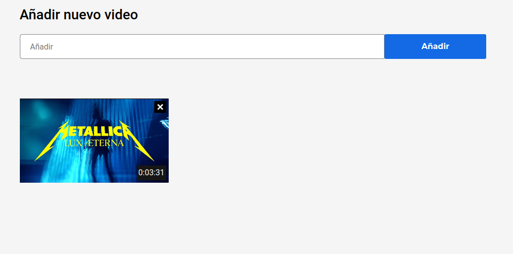
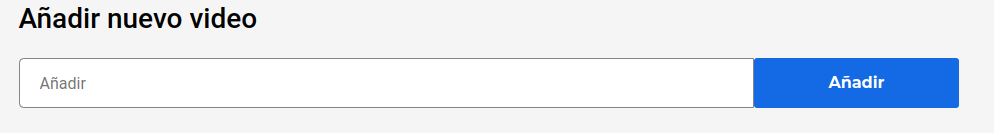
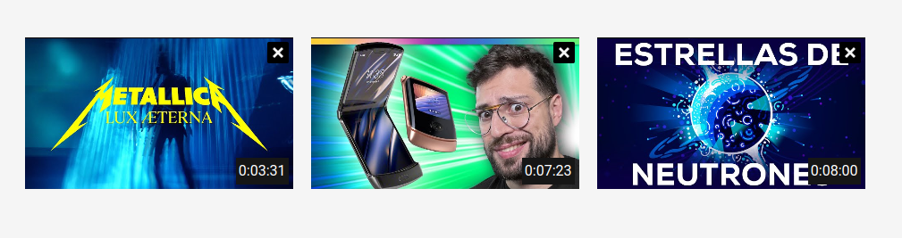
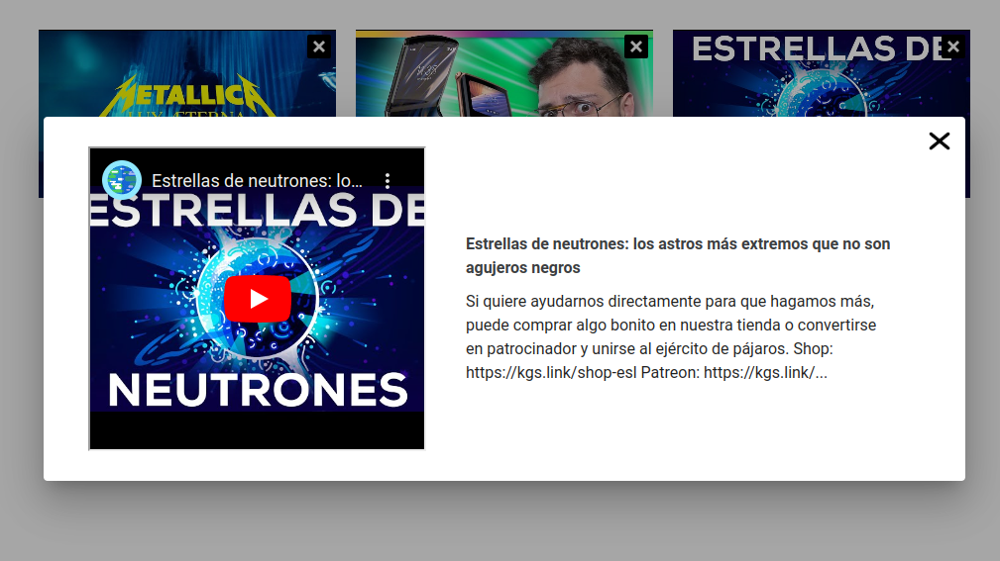

# Youtube AFEX

Es un álbum online con la finalidad de guardar videos de YouTube y también poder verlos. Podrás pegar los links y reproducirlos o eliminarlos cuando gustes.



## Agregar Videos

En la zona de arriba encontrarás una barra donde podrás agregar los videos que quieras en tu álbum online.



## Ver Álbum

En esta zona visualizarás tus elementos guardados con su tiempo de duración.



## Detalle del Video

Aquí puedes reproducir el video y obtener más información con el título y descripción.



## Eliminar Video

Para eliminar el video solo debes darle click a la x del item y confirmar la eliminación

# Instalación
Vue 3 + Vite

El proyecto se ha creado con Vue 3 + Vite 

```bash
git clone https://github.com/FariaSta/test-youtube.git
cd test-youtube
npm install
npm run dev
```

## Recommended IDE Setup

- [VS Code](https://code.visualstudio.com/) + [Volar](https://marketplace.visualstudio.com/items?itemName=Vue.volar) (and disable Vetur) + [TypeScript Vue Plugin (Volar)](https://marketplace.visualstudio.com/items?itemName=Vue.vscode-typescript-vue-plugin).
